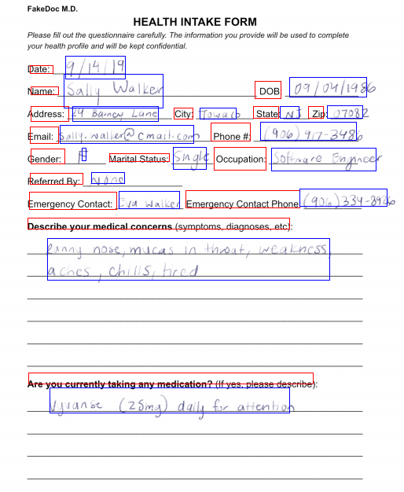
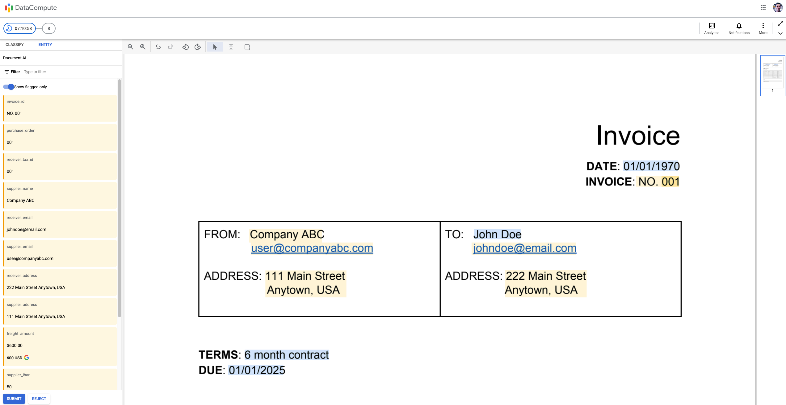
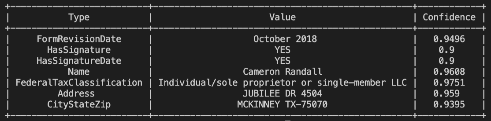

# Document AI LABS

This repository contains sample codes for Document AI of GCP. These are mainly python scripts to be copied and reused, rather than full .ipynb notebooks.

Setup and authentication instructions of Vertex SDK are available [here](https://cloud.google.com/vertex-ai/docs/start/client-libraries). Please, complete those before trying any of the labs below.


## Lab 1: Form parser and Human-in-the-loop

This lab contains some scripts to make predictions with the **Form parser.** It uses a public pdf sample located at `gs://cloud-samples-data/documentai/form.pdf`. 

The form parser supports human-in-the-loop (HITL) for reviewing. The form-parser works with  **Key-level filters**, but not **Document-level filter** option?.

One of the scripts returns a `pandas dataframe` with the fields detected, as well as bounding boxes, generating a result like the following:




## Lab 2: Invoice parser and Human-in-the-loop

This lab contains some scripts to make predictions with the [invoice parser](https://cloud.google.com/document-ai/docs/processors-list#processor_invoice-processor). It uses a public pdf sample located at `gs://cloud-samples-data/documentai/invoice.pdf`.

The invoice parser, as well as other specialized processors, supports **Human-in-the-loop** (HITL) for reviewing. There are **two ways to trigger** a HITL operation: REST API or Python SDK. 

1. With REST API you need to invoke the `projects.locations.processors.process` [method](https://cloud.google.com/document-ai/docs/reference/rest/v1/projects.locations.processors/process). Note the document file must be inline encoded in [base64](https://en.wikipedia.org/wiki/Base64).

```bash
curl -X POST \
    -H "Authorization: Bearer "$(gcloud auth application-default print-access-token) \
    -H "Content-Type: application/json; charset=utf-8" \
    -d @request.json \
    https://eu-documentai.googleapis.com/v1/projects/655797269815/locations/us/processors/bad52526b46aa2b6:process
```

2. With Python SDK you need to invoke `DocumentProcessorServiceClient()` function:
```python
client = documentai.DocumentProcessorServiceClient()
```



Additionally, both the invoice and expense parsers supports [Enterprise Knowledge Graph (EKG) for enrichment](https://cloud.google.com/document-ai/docs/ekg-enrichment). Normalized or enriched fields include:
* Supplier Name (supplier_name)
* Supplier Address (supplier_address)
* Date
* Number
* Price
* Phone Number (supplier_phone)


## Lab 3: W-8 (FACTA) and W-9 parser

This lab contains some scripts to make predictions with the [W-9 parser](https://cloud.google.com/document-ai/docs/processors-list?hl=vi#processor_w9-parser). It can be used for both W-8 (FACTA) and W-9 docs. The difference between W-8 and W-9 forms lies in the fact that the W-9 tax form is only required to be used by US companies or companies operating in the US.

Pretty table result from the python script:




## Lab 4: Tables

This lab extracts tables using the form parser, documentation [here](https://cloud.google.com/document-ai/docs/handle-response#forms_and_tables). It focus only of the JSON output containing the tables information. there are two scripts:
* `tables.py`: extract tables from a pdf file
* `2csv.py`: extract tables from a pdf file, and convert the JSON output to CSV

Another sample code to extract tables can be found [here](https://github.com/holtskinner/python-documentai/blob/main/samples/snippets/process_document_form_sample.py).

And an example that uses Pandas to convert the table to CSV [here](https://github.com/GoogleCloudPlatform/document-ai-samples/tree/main/extract-tables).

## References

[1] Codelab: [Use Procurement Document AI to Parse your Invoices using AI Platform Notebooks](https://codelabs.developers.google.com/codelabs/pdai-invoices-notebook)  
[2] Repository: [Google Cloud Document AI github repository](https://github.com/GoogleCloudPlatform/documentai-notebooks) 


